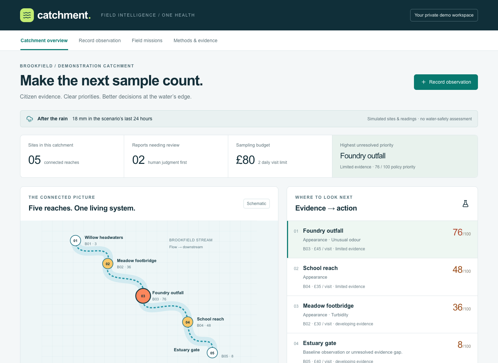

# Catchment

**Five stream sites. Two visits. £80. Make the next sample count.**

Catchment turns citizen observations into an explainable, human-reviewed sampling plan. A coordinator can see what matters, allocate a limited daily budget, dispatch visits, and retain the evidence behind every decision.

Created for the **OneAquaHealth IEEE Global Hackathon 2026 — Track 2: Data-to-Insight**. Project led by **Shivam Gupta**, developed with AI assistance.

> **Field-trial MVP.** Brookfield is a fictional demonstration catchment. Reports, visit costs and site priorities are simulated. The separate Environment Agency rainfall panel uses real open data. This application does not establish water safety, diagnose pollution, predict disease or identify a polluter. Numeric priority weights are unvalidated operational policy.



## Try the complete journey

1. Open the application. It creates your own server-backed demonstration workspace.
2. Choose **Record observation**. Select a site, add a factual description and optional instrument readings. Check the live quality prompts.
3. Save. In the site evidence panel, enter a review rationale and confirm or reject the evidence.
4. Open **Field missions**. Start with £80 and two visits. Change the visit limit to one and inspect the trade-off.
5. Acknowledge the evidence and create missions. Daily commitments, including completed visits, reduce the remaining UTC-day budget and capacity. Open missions are not duplicated.
6. Reload: missions remain. Complete a visit with a factual outcome, then add a linked follow-up observation.
7. In **Methods & evidence**, inspect live rainfall provenance, import CSV, export JSON/CSV/experimental FHIR, and review the activity record.

No API key or paid model inference is required. No email or personal health information is requested.

## Local setup

Requires Node.js **22.13+** and npm. All application dependencies are locked.

```bash
npm ci
npm run build
node --import ./scripts/sites-env.mjs ./node_modules/wrangler/bin/wrangler.js d1 execute DB --local --config dist/server/wrangler.json --persist-to .wrangler/state --file drizzle/0000_create_workspaces.sql
npm run dev
```

Open the exact local URL printed by the dev server (normally `http://localhost:5173`). Apply the initial migration only once to a new local database. The local database is in ignored `.wrangler/state/`. This project uses the Vinext starter's Vite/Worker configuration, not a hand-authored `wrangler.jsonc`.

For a built Worker smoke test, `npm start` runs the built server and reuses the same local database; use its printed URL. The database migration is generated by Drizzle and contains only schema statements.

## Verification

```bash
npm test                 # 22 engine, validation, export and rainfall tests
npm run typecheck
npm run test:browser     # requires local app and installed Playwright Chromium
npm run test:api         # 17 API scenarios; start the local app first
npm run build
```

`CATCHMENT_TEST_URL` can point API tests at a local built Worker instead of port 5173. Tests create isolated synthetic workspaces; do not run them against a real participant dataset. The repository's CI runs unit tests, type checking and a Worker build. See [verification details](docs/verification.md) for browser QA and practical limits.

## How the decision works

- Each signal uses the strongest active non-rejected observation, preventing duplicated reports from adding points.
- Pending reports have reduced influence. Uncalibrated instruments and stale observations have less weight.
- Missing evidence remains unknown; a low priority is not a healthy-water certificate.
- Wildlife distress raises a separate prompt for official incident review regardless of budget.
- The planner enumerates all **32 subsets** of the five demonstration sites. It maximises total policy priority under remaining budget and visit limits; lower cost breaks a tie.
- Each mission freezes the assessment, evidence records, policy version and limits at dispatch. A later review does not rewrite that historical rationale.
- A follow-up observation can reference a completed mission at the same site.

See [policy and scientific limitations](docs/policy.md). Exact enumeration is deliberately bounded to this five-site pilot. A larger deployment needs a suitable optimiser, travel-time model and ecological evaluation; this is not a general route optimiser.

## Architecture

React/TypeScript + accessible Radix/shadcn controls → same-origin Worker API → Cloudflare D1.

- `lib/catchment/engine.ts`: pure validation, priority policy, allocation.
- `lib/catchment/model.ts`: explicit data model and fictional site catalogue.
- `app/api/workspace/route.ts`: all state transitions with server validation.
- `lib/catchment/store.ts`: prepared statements, isolated session lookup and optimistic concurrency.
- `lib/catchment/rainfall.ts`: actual-provider parsing, timestamps, gaps and staleness.
- `lib/catchment/exports.ts`: CSV import/export, complete JSON evidence and experimental FHIR R4.
- `db/schema.ts` and `drizzle/`: one bounded workspace document per session, plus revision and expiry.

D1 holds the authoritative record. Browser storage is not used for project data. Writes are atomic compare-and-swap updates; concurrent tabs receive a conflict rather than silently overwriting another decision. A 100-request deduplication window supports retrying the same mutation identifier. See [architecture and API](docs/architecture.md).

## Data, standards and attribution

**This uses Environment Agency rainfall data from the real-time data API (Beta).** Available under the [Open Government Licence v3](https://www.nationalarchives.gov.uk/doc/open-government-licence/version/3/). [API documentation](https://environment.data.gov.uk/flood-monitoring/doc/rainfall). A genuine provider fixture is included for regression tests, with its metadata and timestamps intact.

FHIR is an **experimental R4 collection** containing fictional Locations and environmental Observations. It uses explicit quantities and local text concepts; no LOINC equivalence, certified profile conformance, patient data or clinical connection is claimed. JSON is the complete decision packet; CSV carries observations. See [interoperability](docs/interoperability.md) and [source notes](docs/sources.md).

## Security and production scope

The demonstration uses an unguessable HttpOnly, SameSite=Strict session cookie (Secure over HTTPS), same-origin mutation checks, parameterised SQL, server bounds, atomic imports and CSV formula neutralisation. Each anonymous browser receives an isolated workspace; this is **not** a multi-person organisation account system.

Limits: 200 observations, 50 missions, 512 KB workspace JSON, 64 KB mutation requests, 50 rows per import. Access expires after 30 days. Bounded cleanup removes expired records on new-session creation; a scheduled purge and formal retention controls are production work. The most recent 250 audit entries are retained; this is not an immutable compliance ledger.

Before a real pilot: implement organisation identity/roles, scheduled deletion, ingress rate limits, observability/backups, ecological policy review, approved local incident guidance and accessible field testing. Hosted platform safeguards do not replace these. See [security scope](SECURITY.md).

## Commercial experiment

A free citizen experience with a proposed **£129/month programme workspace**. A proposed **£750 six-week pilot** tests coordinator preparation time, reviewer edits and follow-up completion. These are pricing and value hypotheses, not customers, revenue, partnerships or measured environmental outcomes. No inference API cost is required; hosting, support and domain-review costs remain.

## Build provenance and eligibility

Work started **14 September 2026**, with accurate commit history. The Devpost overview says September 14–30, while written rules and the organiser page specify development September 16–30. Registration and student/team requirements also conflict across pages. This prototype must not be represented as eligibility-confirmed until the organiser resolves those discrepancies. An AI assistant is not a human teammate. See [official rules](https://oneaquahealth-ieee-hackathon.devpost.com/rules).

## Licence and credit

Application code: MIT, copyright Shivam Gupta. Third-party dependencies retain their respective licences; the starter is based on Vinext and the supplied Sites starter. Source attribution appears in the application and documentation. Shivam supplied the project goals, product constraints and direction; implementation, research and testing used AI assistance.
